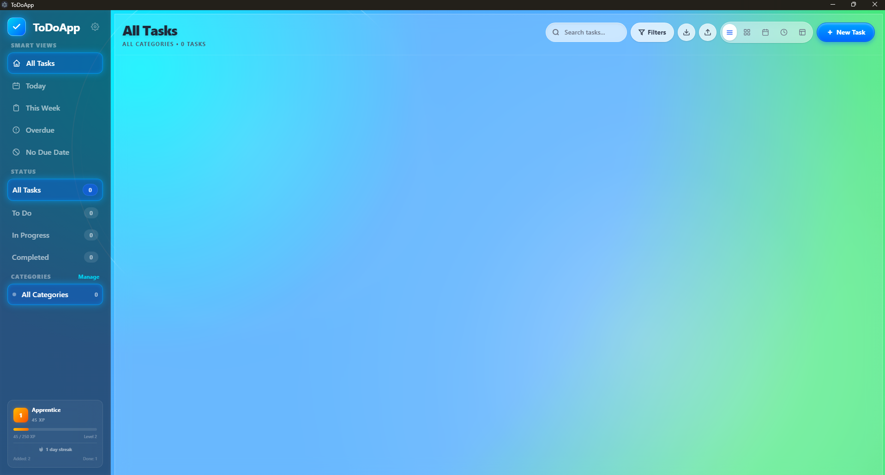
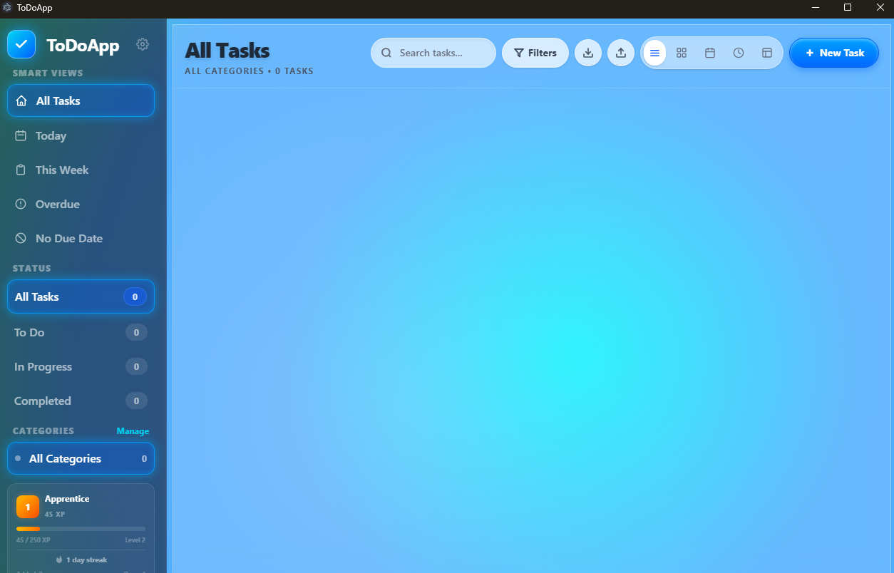
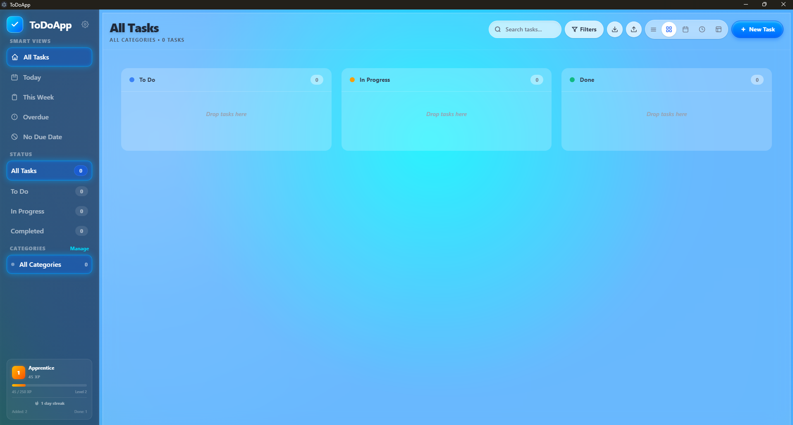
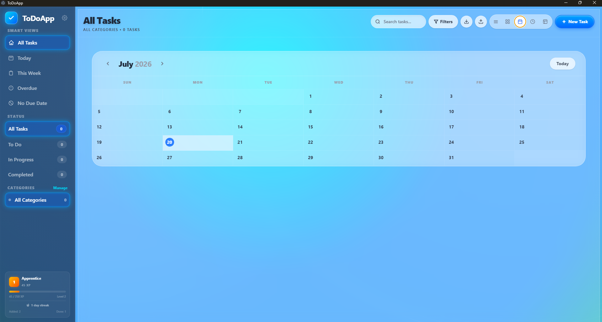
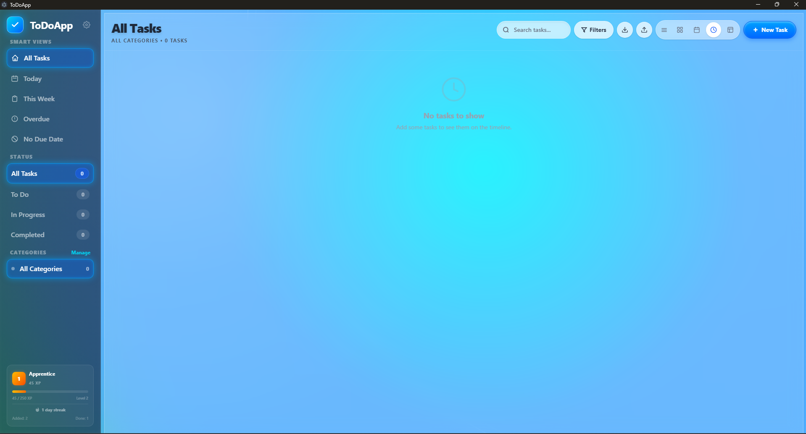
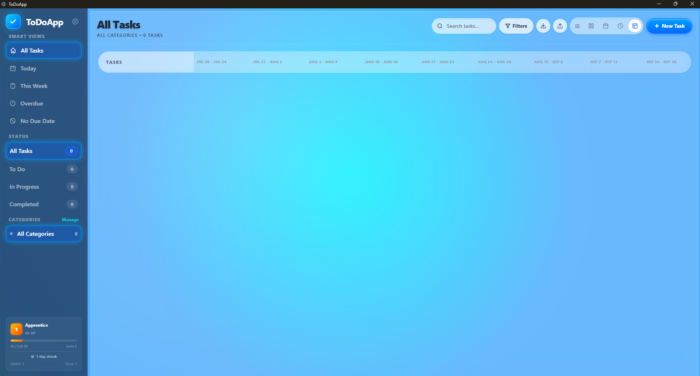
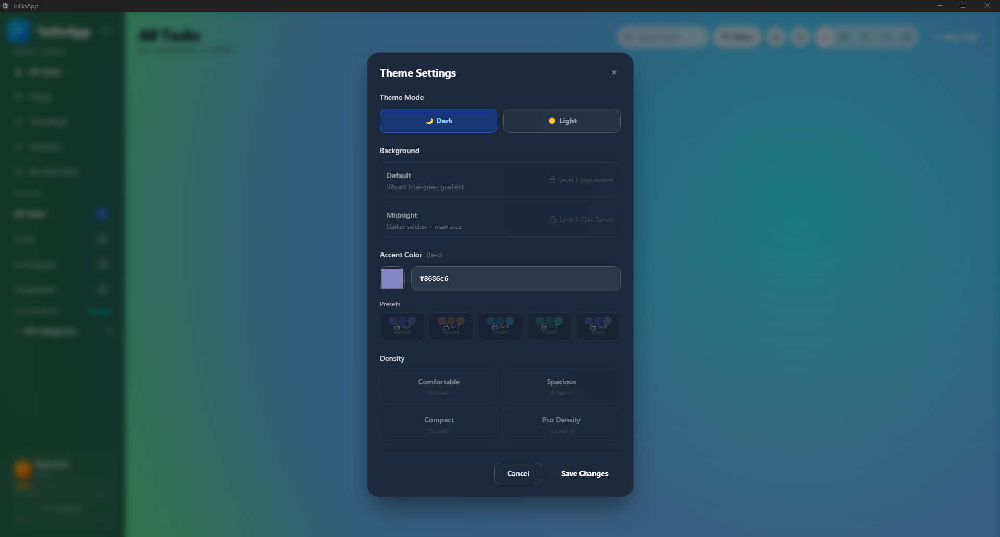

# ToDoApp

A feature-rich, visually stunning desktop task management application built with **Electron**, **React**, **TypeScript**, and **SQLite**. Featuring a **Frutiger Aero / Windows Vista-era glassmorphism** design language alongside Kanban, Calendar, Timeline, and Gantt views, a Pomodoro timer, gamified progression with unlockable themes, and smart task organization.

---

## Screenshots















---

## Features

### Core Task Management

- **Full CRUD Operations** — Create, read, update, and delete tasks with a clean, responsive interface.
- **Priority Levels** — Assign Low, Medium, or High priority. Tasks sort automatically within their status group.
- **Status Tracking** — Three states: To Do, In Progress, and Done. Click the circular checkbox to toggle instantly between To Do and Done.
- **Due Dates** — Attach optional due dates via a native date picker, used by smart views and visual calendars.
- **Rich Descriptions** — Add detailed descriptions for context and notes.
- **Recurring Tasks** — Set tasks to repeat daily, weekdays (Mon-Fri), weekly, biweekly, monthly, or yearly. When a recurring task is completed, the next instance is auto-generated with the correct due date.

### Smart Views & Organization

- **Smart Views** — Sidebar quick-filters powered by server-side SQL queries:
  - **Today** — All tasks due today
  - **This Week** — Tasks due within the next 7 days
  - **Overdue** — Past-due tasks highlighted in red
  - **No Due Date** — Unscheduled tasks
- **Categories** — Create custom categories with unique color labels. Manage (rename, recolor, delete) through a dedicated modal.
- **Status Filters** — All, To Do, In Progress, Completed — each with live task counts.
- **Category Filters** — Filter tasks by any category from the sidebar.
- **Smart Filters** — Quick-access header dropdown: All Tasks, High Priority, Favorites.
- **Search** — Real-time text search across task titles with instant filtering.

### Multiple Visual Views

Switch between five views using the header toolbar or keyboard shortcuts:

1. **List View** (default) — Traditional card list with inline status toggle, favorite star, due dates, overdue highlighting, and relative date formatting ("Today", "3 days ago", etc.).
2. **Kanban Board** — Drag-and-drop columns (To Do, In Progress, Done) using @dnd-kit. Cards display priority, category, and due date. Optimistic state updates prevent visual snap-back on cross-column drops. Empty columns remain droppable.
3. **Calendar View** — Monthly grid with day-of-week headers. Each day shows task dots and a count badge. Click a day to open a side panel listing that day's tasks, or click "Add task on this date" to pre-fill the new-task modal.
4. **Timeline View** — Vertical agenda grouped by date ranges: Overdue, Today, Tomorrow, This Week, Next Week, Later, Unscheduled, Recently Done. Decorative timeline line with colored dots.
5. **Gantt Chart** — 14-week horizontal bar chart. Each task is a bar spanning from `created_at` to `due_date`. Week headers, day gridlines, a today marker, and a synchronized left panel with task names.

### Quick Capture

- **Global Hotkey** (`Ctrl+Shift+T`) — Opens a minimal input overlay from anywhere, even when the app window is minimized. Type a title and press Enter to instantly create a task.
- The modal also supports scheduling a due date, priority, category, and description if you need more than a title.

### Favorites System

- Star any task to mark it as a favorite (glowing gold star when active).
- The smart filter menu isolates all favorited tasks.
- Favorite state persists in SQLite across app restarts.

### Pomodoro Timer

- Built-in focus timer in the header toolbar: 25-minute focus sessions, 5-minute breaks, 15-minute long break every 4 cycles.
- Start a focus session on any task by clicking the timer icon on its card.
- Pause, resume, stop, and skip controls. Native OS notification (Electron `Notification` API) when a session completes.
- Drag-sortable task list respects `sort_order` column with a reorder IPC handler.

### Gamification & Progression

Complete tasks, maintain streaks, and level up to unlock exclusive themes and UI perks:

| Action | Base XP |
|--------|---------|
| Add a task | 10 XP |
| Complete a task | 25 XP |
| Complete an overdue task (catch-up) | 50 XP |

- **Streak Multiplier** — Consecutive daily activity boosts XP: 1x (day 1) -> 1.5x (day 2) -> 2x (day 3) -> 2.5x (day 4) -> 3x (day 5+, cap).
- **Variable Reward** — 10% chance of double XP on each task completion (a hook borrowed from engagement game design).
- **Leveling Curve** — `50 x N^2 + 50` XP per level, capped at level 10.

  | Level | Title | Unlocks |
  |-------|-------|---------|
  | 1 | Apprentice | — |
  | 2 | Apprentice | Sunset Palette (warm oranges, pinks, coral) |
  | 3 | Task Tamer | Midnight Background (darker sidebar + main area) |
  | 4 | Task Tamer | — |
  | 5 | Productivity Pro | Ocean Theme (teal/cyan accents, sea-foam) |
  | 6 | Productivity Pro | — |
  | 7 | Focus Master | Forest Theme (green/emerald accents, natural tones) |
  | 8 | Focus Master | — |
  | 9 | Task Legend | Royal Theme (purple/gold accents, regal backgrounds) |
  | 10 | Task Legend | Pro Density (extra compact UI mode) |

- **Sidebar XP Bar** — Current level badge, title, progress toward next level, and streak counter with fire indicator.
- **XP Toast** — Floating notification on task actions (auto-dismiss after 2.2 seconds). Special styling for streak multipliers and variable bonuses.
- **Level-Up Celebration** — Animated overlay showing your new level, title, and any newly unlocked items.
- **Theme Gating** — The Theme Settings dialog shows locked items with a lock icon and "Reach Level X" requirement. Unlocked items are selectable.

### Theme System

- **Light / Dark Mode** — Switch between themes with persisted preference.
- **Density Options** — Compact, Comfortable, or Spacious UI density.
- **Accent Color** — Customize with a hex picker. Live preview card shows the effect before applying.
- **Unlockable Themes** — 5 visual themes unlocked through gameplay: Sunset, Midnight, Ocean, Forest, Royal.
- **Persistent Preferences** — All settings stored in SQLite, preserved across sessions.

### Data Backup

- **Export** — Download your entire task database (tasks, categories, theme preferences) as a JSON file.
- **Import** — Restore from a previously exported JSON file. Replaces all existing data.

### Keyboard Shortcuts

| Key | Action |
|-----|--------|
| `N` | New task |
| `1` | List view |
| `2` | Kanban board |
| `3` | Calendar view |
| `4` | Timeline view |
| `5` | Gantt chart |
| `/` | Focus search bar |
| `?` | Toggle shortcuts help |
| `Esc` | Close modals / cancel |
| `Ctrl+Shift+T` | Quick capture (global) |

Shortcuts are disabled when an input field is focused to avoid conflicts with typing.

### Security

- **Content-Security-Policy** set via Electron `session.webRequest.onHeadersReceived` with separate policies for development (allows Vite HMR WebSocket connections) and production (strict `default-src 'self'`). Both allow Google Fonts CDN.
- **contextIsolation: true**, **nodeIntegration: false**, **webSecurity: true**.

---

## UI / UX Design

### Aero Glass (Frutiger Aero) Aesthetic

The interface is deliberately styled after the **Windows Vista / 7 Aero Glass** era — glossy, translucent surfaces and vibrant gradients:

| Element | Technique |
|---------|-----------|
| **Background** | Interactive particle canvas (dynamic floating connections) over a deep navy fallback |
| **Panels** | `backdrop-filter: blur(16px)` glass effect with semi-transparent backgrounds |
| **Sidebar** | Dark translucent glass panel with subtle inset shadow and border glow |
| **Selected Items** | Neon cyan glow (`box-shadow` + `border`) with `rgba(0, 163, 255, 0.6)` aura |
| **Buttons** | Linear gradient with inset highlight, mimicking glossy plastic |
| **Stars** | SVG star icons with CSS `drop-shadow` glow for the filled state (`glowPulse` animation) |
| **Scrollbar** | Custom thin scrollbar with translucent thumb matching the glass theme |

### Animations

- Task cards scale on hover (`scale(1.01)`) with shadow elevation.
- Edit/delete action buttons fade in on card hover.
- Modals animate with `slideUp` (translateY + fadeIn) cubic-bezier easing.
- XP toasts slide up with color-coded backgrounds (normal white, streak orange gradient, bonus amber gradient).
- Level-up overlay scales in with a blurred backdrop.
- Notification badges pulse with a `glowPulse` keyframe animation.
- Category and status badges have smooth color transitions.

---

## Tech Stack

| Layer | Technology |
|-------|-----------|
| **Desktop Shell** | Electron 34 |
| **UI Framework** | React 18.3 |
| **Language** | TypeScript 5.5 (strict mode, both processes) |
| **Bundler** | Vite 5.4 (React plugin, HMR dev server) |
| **Styling** | Tailwind CSS 4.3 + PostCSS + Autoprefixer |
| **Database** | better-sqlite3 12.10 (synchronous, zero-config SQLite) |
| **Font** | Inter (Google Fonts) |
| **Drag and Drop** | @dnd-kit (core, sortable, utilities) |
| **Build / Packaging** | electron-builder (Windows portable target) |
| **Test Runner** | Vitest with jsdom |
| **Concurrency** | concurrently + wait-on |

### Why better-sqlite3?

Unlike its asynchronous counterparts, `better-sqlite3` runs synchronously on the main thread, simplifying IPC handler code. The `journal_mode = DELETE` pragma ensures maximum filesystem compatibility (avoids WAL-mode issues on network drives and some Windows configurations).

---

## Architecture

### Process Model

```
Electron Application
  Main Process (Node.js)  <--IPC-->  Renderer Process (Chromium + React)
    db.ts                            App.tsx + all view components
    ipcHandlers.ts                   20 IPC methods via preload bridge
    preload.ts
```

The app follows Electron's standard **two-process architecture**:

**Main Process** (`electron/`) — Node.js environment:
- Window creation and lifecycle management.
- SQLite database: schema creation, migrations (guarded `ALTER TABLE ADD COLUMN`), all CRUD operations, smart view queries, XP/stat calculations, recurring task generation, JSON export/import.
- IPC handler registration (20 handlers covering tasks, categories, themes, templates, stats, notifications).
- Global shortcut registration (`Ctrl+Shift+T` for quick capture).
- CSP header injection.
- Native OS notifications (Pomodoro timer).

**Renderer Process** (`src/electron/renderer/`) — Chromium sandbox:
- React SPA rendered by Vite, with all view components and modals.
- State management via React hooks (`useState`, `useCallback`, `useMemo`, `useRef`).
- Access to Electron APIs only through the `contextBridge` in `preload.ts`.

### IPC Bridge (Security)

Communication goes through a **contextBridge** (`preload.ts`) exposing a typed `window.electronAPI` object:

- `contextIsolation: true` — Renderer cannot access Node.js or Electron APIs directly.
- `nodeIntegration: false` — No `require()` in the renderer.
- `sandbox: false` — Required for better-sqlite3 native module.
- `webSecurity: true` — Standard web security enforced.

### Data Flow

```
User toggles task complete
  -> handleToggle(task)
    -> electronAPI.updateTask({ id, status: 'done' })
      -> IPC: renderer -> main (tasks:update)
        -> SQL: UPDATE tasks SET status = ?, updated_at = datetime('now')
        -> If recurring: auto-generate next instance
        -> xpResult = stats:add-xp
          -> XP: base + streak multiplier + variable bonus
          -> SQL: UPDATE user_stats
      <- IPC: main -> renderer (updated task row + XpResult)
    -> loadTasks()
      -> electronAPI.getTasks()
        -> IPC: renderer -> main (tasks:get-all)
          -> SQL: SELECT ... FROM tasks t LEFT JOIN categories c ...
        <- IPC: main -> renderer (full task list)
    -> setTasks(result) -> React re-render
    -> showXpResult(xpResult) -> XP toast / level-up overlay
```

### Database Migrations

The schema uses a migration pattern based on `PRAGMA table_info`:
- New tables are created with `CREATE TABLE IF NOT EXISTS`.
- New columns on existing tables are added via `ALTER TABLE ADD COLUMN` guarded by a column existence check.
- This handles the case where a database was created by an older version of the app.

---

## Database Schema

### `tasks` Table

```sql
CREATE TABLE IF NOT EXISTS tasks (
  id          INTEGER PRIMARY KEY AUTOINCREMENT,
  title       TEXT NOT NULL,
  description TEXT NOT NULL DEFAULT '',
  due_date    TEXT,
  priority    TEXT NOT NULL DEFAULT 'medium'
              CHECK(priority IN ('low', 'medium', 'high')),
  status      TEXT NOT NULL DEFAULT 'todo'
              CHECK(status IN ('todo', 'in-progress', 'done')),
  category_id INTEGER,
  is_favorite INTEGER NOT NULL DEFAULT 0,
  sort_order  INTEGER NOT NULL DEFAULT 0,
  recurrence  TEXT CHECK(recurrence IN ('daily','weekdays','weekly','biweekly','monthly','yearly')),
  created_at  TEXT NOT NULL DEFAULT (datetime('now')),
  updated_at  TEXT NOT NULL DEFAULT (datetime('now'))
);
```

### `categories` Table

```sql
CREATE TABLE IF NOT EXISTS categories (
  id    INTEGER PRIMARY KEY AUTOINCREMENT,
  name  TEXT NOT NULL UNIQUE,
  color TEXT NOT NULL DEFAULT '#6366f1'
);
```

### `theme_prefs` Table (singleton)

```sql
CREATE TABLE IF NOT EXISTS theme_prefs (
  id              INTEGER PRIMARY KEY CHECK (id = 1),
  mode            TEXT NOT NULL DEFAULT 'dark'
                  CHECK(mode IN ('light', 'dark')),
  accent_color    TEXT NOT NULL DEFAULT '#6366f1',
  density         TEXT NOT NULL DEFAULT 'comfortable'
                  CHECK(density IN ('compact', 'comfortable', 'spacious')),
  unlocked_themes TEXT DEFAULT '[]',
  player_title    TEXT,
  status_emoji    TEXT DEFAULT ''
);
```

### `templates` Table

```sql
CREATE TABLE IF NOT EXISTS templates (
  id          INTEGER PRIMARY KEY AUTOINCREMENT,
  name        TEXT NOT NULL UNIQUE,
  description TEXT NOT NULL DEFAULT '',
  created_at  TEXT NOT NULL DEFAULT (datetime('now')),
  updated_at  TEXT NOT NULL DEFAULT (datetime('now'))
);
```

### `template_tasks` Table

```sql
CREATE TABLE IF NOT EXISTS template_tasks (
  id          INTEGER PRIMARY KEY AUTOINCREMENT,
  template_id INTEGER NOT NULL REFERENCES templates(id) ON DELETE CASCADE,
  title       TEXT NOT NULL,
  description TEXT NOT NULL DEFAULT '',
  priority    TEXT NOT NULL DEFAULT 'medium'
              CHECK(priority IN ('low', 'medium', 'high')),
  category_id INTEGER,
  sort_order  INTEGER NOT NULL DEFAULT 0
);
```

### `user_stats` Table (singleton)

```sql
CREATE TABLE IF NOT EXISTS user_stats (
  id                    INTEGER PRIMARY KEY CHECK (id = 1),
  level                 INTEGER NOT NULL DEFAULT 1,
  xp                    INTEGER NOT NULL DEFAULT 0,
  total_tasks_added     INTEGER NOT NULL DEFAULT 0,
  total_tasks_completed INTEGER NOT NULL DEFAULT 0,
  current_streak        INTEGER NOT NULL DEFAULT 0,
  longest_streak        INTEGER NOT NULL DEFAULT 0,
  last_active_date      TEXT
);
```

The database file is stored at `%APPDATA%/ToDoApp/tasks.db` (Windows).

---

## Project Structure

```
ToDoApp/
├── electron/                          # Main process (Node.js)
│   ├── main.ts                        # App entry, window, shortcuts, CSP, notifications
│   ├── db.ts                          # SQLite init, schema, migrations, connection
│   ├── ipcHandlers.ts                 # All 20 IPC handlers
│   ├── preload.ts                     # contextBridge (20 methods)
│   └── tsconfig.json                  # Main process TypeScript config
│
├── src/                               # Renderer process (React + Vite)
│   ├── electron/renderer/
│   │   ├── index.html                 # HTML template (Inter font)
│   │   ├── main.tsx                   # React DOM entry
│   │   ├── App.tsx                    # Main app (state, routing, layout, all views)
│   │   ├── App.css                    # Tailwind import + Aero glass styles + keyframes
│   │   ├── vite-env.d.ts             # Vite + electronAPI type declarations
│   │   └── components/
│   │       ├── BackgroundEffect.tsx   # Interactive particle canvas background
│   │       ├── CalendarView.tsx       # Monthly calendar grid + day panel
│   │       ├── CategoryManager.tsx    # Category CRUD modal
│   │       ├── FocusTimer.tsx         # Pomodoro timer (pill + expanded panel)
│   │       ├── GanttView.tsx          # 14-week horizontal Gantt chart
│   │       ├── KanbanBoard.tsx        # Drag-and-drop kanban (@dnd-kit)
│   │       ├── TaskCard.tsx           # Task card component
│   │       ├── TaskList.tsx           # Task list wrapper
│   │       ├── TaskModal.tsx          # Create/edit task modal (with recurrence)
│   │       ├── ThemeSettings.tsx      # Theme settings (with unlock gating)
│   │       ├── TimelineView.tsx       # Vertical timeline agenda
│   │       └── XpBar.tsx             # Sidebar XP bar + streak display
│   └── types/
│       └── task.ts                    # All shared types, XP helpers, level/unlock data
│
├── src/test/                          # Unit tests (Vitest + jsdom)
│   ├── setup.ts                       # jest-dom matchers import
│   ├── database.test.ts               # Schema, migrations, CRUD (14 tests)
│   ├── helpers.test.ts                # Level titles, unlocks, XP curve (26 tests)
│   └── date-helpers.test.ts           # Overdue logic, date formatting, XP math (16 tests)
│
├── screenshots/                       # App screenshots for README
├── release/                           # electron-builder output (gitignored)
├── dist/                              # Vite build output (gitignored)
├── dist-electron/                     # Compiled main process (gitignored)
│
├── package.json                       # Dependencies, scripts, electron-builder config
├── tsconfig.json                      # Renderer TypeScript config
├── electron/tsconfig.json             # Main process TypeScript config
├── vite.config.ts                     # Vite configuration
├── vitest.config.ts                   # Vitest configuration
├── postcss.config.js                  # PostCSS: Tailwind + Autoprefixer
├── tailwind.config.js                 # Tailwind content paths
├── electron.d.ts                      # Global Window.electronAPI types
├── PROJECT_GOAL.txt                   # Project objectives
└── README.md                          # This file
```

---

## Getting Started

### Prerequisites

- **Node.js** 18+ (LTS recommended)
- **npm** 9+

### Installation

```bash
# Clone the repository
git clone https://github.com/TankTopGorilla/ToDoApp.git
cd ToDoApp

# Install dependencies
npm install

# Rebuild native modules (better-sqlite3 for your Electron version)
npm run rebuild
```

### Development

```bash
# Run in development mode (Vite HMR + Electron)
npm run electron:dev
```

This runs two processes concurrently:
1. **Vite dev server** on `http://localhost:5173` with hot module replacement.
2. **Electron** window loading from the dev server, with DevTools auto-open.

React components hot-reload instantly. Electron main process changes require a restart.

### Building for Production

```bash
# Build the full Windows portable executable
npm run electron:build
```

Output: `release/ToDoApp Setup.exe` (Windows portable — runs standalone without installation).

### Available Scripts

| Script | Description |
|--------|-------------|
| `npm run dev:renderer` | Start Vite dev server only |
| `npm run build:renderer` | Type-check + Vite production build |
| `npm run build:electron` | Compile main process TypeScript (to `dist-electron/`) |
| `npm run electron:dev` | Full dev mode (Vite + Electron, concurrent) |
| `npm run electron:build` | Full production build + Windows packaging |
| `npm run rebuild` | Rebuild native modules (better-sqlite3) |
| `npm run postinstall` | Auto-rebuild native modules after install |
| `npm test` | Run all unit tests (Vitest) |
| `npm run test:watch` | Run tests in watch mode |

### Testing

```bash
# Run all tests
npm test

# Watch mode
npm run test:watch
```

Tests use **Vitest** with **jsdom**. The database tests use `sql.js` as an in-memory SQLite replacement (since `better-sqlite3` is compiled for Electron's Node.js version, not the system Node.js).

**Test coverage:**
- **Database tests** (14): schema creation (6 tables), column migrations (3), CRUD operations (6).
- **Helper tests** (26): level titles, unlocks per level, XP-for-level curve, level-from-XP calculation, curve consistency.
- **Date/XP tests** (16): overdue detection, date formatting, XP math with streak multipliers and variable bonuses.

---

## Development Notes

### Type Safety

TypeScript strict mode is enabled throughout. Shared types live in `src/types/task.ts` and are referenced by both processes. The `electron.d.ts` file augments the global `Window` interface with fully typed `electronAPI` method signatures for compile-time IPC safety.

### IPC Handler Pattern

All handlers follow a discriminated error pattern:

```typescript
ipcMain.handle('resource:action', async (_event, payload) => {
  try {
    const db = getDb();
    return db.prepare('...').run(payload);
  } catch (error) {
    return { error: error instanceof Error ? error.message : 'Unknown error' };
  }
});
```

The renderer discriminates results with a type guard:

```typescript
function isErrorResult(value: unknown): value is { error: string } {
  return typeof value === 'object' && value !== null && 'error' in value;
}
```

### Event Propagation

Interactive elements inside task cards (favorite star, status checkbox, edit/delete buttons, focus timer) use `e.stopPropagation()` and `e.preventDefault()` to prevent accidental bubbling to parent click handlers.

### Defensive Data Handling

The `is_favorite` field uses `task.is_favorite || 0` before comparison to guard against `undefined` values from schema migrations or partial data — `undefined === 1` is always `false`.

### State Mutation Cycle

All state mutations follow **update -> reload -> re-render**. After every write, the full task list is re-fetched from SQLite, keeping UI and database in sync. The Kanban board additionally applies **optimistic updates**: local state is set immediately before the IPC call, preventing visual snap-back on cross-column drags.

### Code Style

- TypeScript strict mode enforced.
- IPC handler names follow `resource:action` convention.
- SQL queries use named parameters (`@param`) over positional (`?`) for clarity in complex statements.
- Component props explicitly typed via `interface`.
- Shared type definitions in `src/types/task.ts` used by both processes.

---

## Contributing

1. Fork the repository.
2. Create a feature branch (`git checkout -b feature/amazing-feature`).
3. Make your changes.
4. Ensure TypeScript compiles clean (`npx tsc --noEmit`).
5. Run tests (`npm test`).
6. Commit your changes (`git commit -m 'Add amazing feature'`).
7. Push to the branch (`git push origin feature/amazing-feature`).
8. Open a Pull Request.

---

## License

This project is open source. Feel free to use, modify, and distribute.

---

## Acknowledgments

- **Frutiger Aero aesthetic** — Inspired by the late-2000s Windows Vista / 7 design language with glossy glass surfaces and vibrant gradients.
- **@dnd-kit** — Modern drag-and-drop toolkit for the Kanban board.
- **Tailwind CSS** — Utility-first CSS framework.
- **Vite** — Fast dev server and build tooling.
- **Electron** — Cross-platform desktop application framework.
- **better-sqlite3** — Synchronous SQLite3 binding for Node.js.
